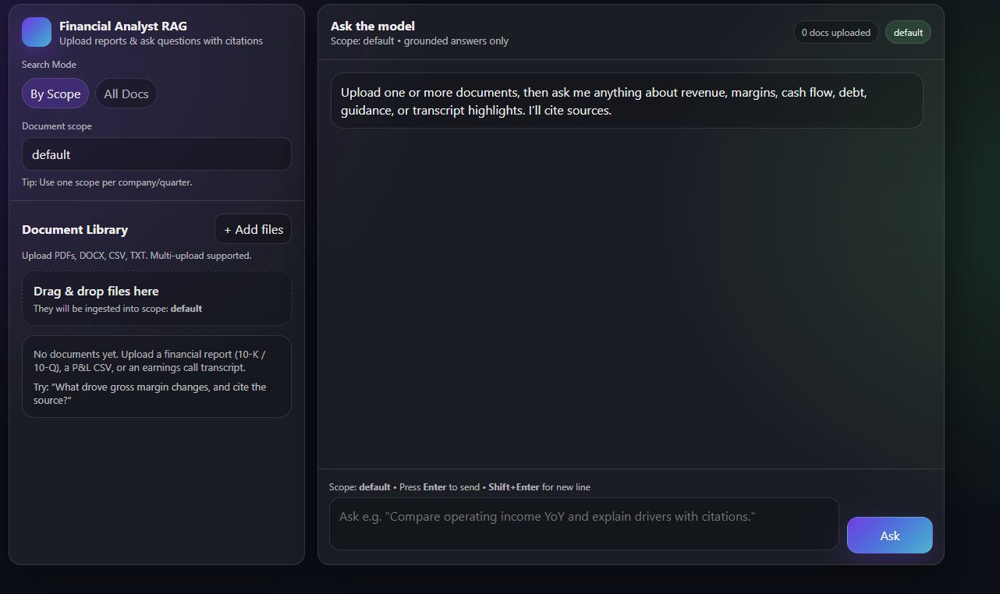

# Financial Analyst RAG System (Local → Vercel)

A Retrieval-Augmented Generation (RAG) system that answers questions over **financial documents** (P&L, balance sheets, earnings call transcripts, CSV tables) with **grounded citations**.

You can **upload multiple documents**, group them by **scope** (e.g., `acme_q3_2025`), and ask questions like:
- “What drove gross margin changes YoY? Cite sources.”
- “Compute current ratio and explain the change QoQ (show math).”
- “Summarize guidance from the earnings call and cite the exact lines/pages.”

---

## 🚀 Features

- 📄 Multi-document ingestion (PDF/DOCX/CSV/TXT)
  - SEC filings (10-Q / 10-K PDFs)  
  - Earnings call transcripts (TXT / PDF)  
  - CSV financial statements (P&L-style tables)

- 🔍 Semantic retrieval using vector search  
- 🧠 LLM-powered financial analysis  
- 📌 Source-aware answers (retrieved chunks)  
- 🧪 Evaluation-ready (RAGAS-compatible design)  
- 🌐 Local + serverless deployment (Vercel)
- **Modern UI**: drag & drop, library panel, chat bubbles, source expanders

---

## Architecture (High-level)

User
↓
Web UI (Next.js)
↓
FastAPI Backend (RAG Service)
↓
Vector Database (Pinecone)
↓
LLM (OpenAI)

**RAG pipeline**
1. Upload documents
2. Parse & chunk text
3. Generate embeddings
4. Store vectors in Pinecone
5. Retrieve top-K relevant chunks
6. Generate grounded answer with LLM (OpenAI) with citations

---

## 🛠️ Tech Stack

### Backend
- Python 3.11+
- FastAPI
- LangChain
- OpenAI API
- Pinecone (Vector Database)

### Frontend
- Next.js (App Router)
- TypeScript
- Tailwind CSS

### Dev & Ops
- Vercel (Serverless)
- Uvicorn (local development)
- VS Code
- draw.io / Excalidraw (architecture diagrams)

---

## 📁 Repository Structure

```text
financial-rag-analyst/
├── api-backend/
│   ├── api/
│   │   ├── index.py          # FastAPI app
│   │   ├── health.py         # Health endpoint
│   │   └── rag/
│   │       ├── loaders.py
│   │       ├── chunking.py
│   │       ├── embeddings.py
│   │       ├── vectorstore.py
│   │       ├── retrieval.py
│   │       └── answer.py
│   └── requirements.txt
│
├── web/
│   ├── app/
│   │   ├── api/              # Next.js route handlers
│   │   └── page.tsx          # UI
│   └── package.json
│
└── README.md


## ▶️ Run Locally (Recommended for Demo)
** 1️⃣ Backend (FastAPI)

```text
cd api-backend
python -m venv .venv
source .venv/bin/activate   # Windows: .\.venv\Scripts\Activate.ps1
pip install -r requirements.txt


Create .env:

```text
OPENAI_API_KEY=your_key
PINECONE_API_KEY=your_key
PINECONE_INDEX=financial-rag-analyst
PINECONE_CLOUD=aws
PINECONE_REGION=us-east-1


Run the API:

```text
uvicorn api.index:app --reload --port 8000 --env-file .env


Test:

http://127.0.0.1:8000/health

http://127.0.0.1:8000/docs

** 2️⃣ Frontend (Next.js)
cd web
npm install
npm run dev


Open:

http://localhost:3000

## How to Use
** Upload
- Enter a scope (e.g., acme_q3_2025)
- Drag & drop one or many documents into the uploader
- Confirm ingestion status in the Document Library

** Ask Questions
- Choose By Scope or All Docs
- Ask your question
- Expand Sources to see page/section citations + snippets

